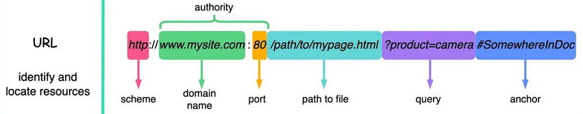

# URL

Stands for `Uniform Resource Identifier`. It identifies a logical or physical resource on the web.

We can provide fetch a URL in in the shape of a `string`, or using the `URL` object, which allows to control any of the URL's parts (schema, domain, port, path, query, params)

# Request options
- `method` - 
- `body`- 
- `headers`- 
- `cache`- 

# Cache